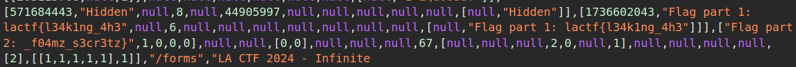

# INFINITE LOOP

I found this google form but I keep getting stuck in a loop! Can you leak to me the contents of form and the message at the end so I can get credit in my class for submitting? Thank you!

The Google form is reachable here: https://docs.google.com/forms/d/e/1FAIpQLSfgUDWRzgkSC2pppOx_SVdw1E9bpVVWUkvQssmWza11pufMUQ/viewform?usp=sf_link.

In this form the user is stuck in a loop, seems like the end of the form cannot be reahced so I decide to inspect the source code (using the developers tools) and that's at this point that I noticed the flag is hidden here.

The final flag is: lactf{l34k1ng_4h3_f04mz_s3cr3tz}