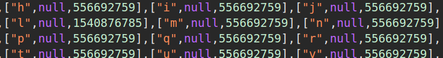
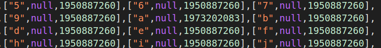

# ONE BY ONE WRITEUP

One..... by.......... one............... whew I'm tired, this form is waaaaaaay too long.

Note: the flag does have random characters at the end - that is intentional.

We have again another Google form: https://docs.google.com/forms/d/e/1FAIpQLSc-A-Vmx_Te-bAqnu3TrRj-DAsYTgn52uSk92v3fECQb3T83A/viewform

Here the form ask every time to select between all the numbers, lowercase or uppercase alphabet's letters or some symbols. My intuition is to guess the flag but it's impossible to solve this challenge in this way.

Hence I decide to inspect the page. I know the flag starts with the combination "lactf{" so I focus my attention on this characters. What I notice is that in all the cases the characters of the flag are associated with a different value with respect to the other ones.

At the end the solution is to inspect the page for every character of the flag and understand which one has a different value with respect to all the others.

The final flag is: lactf{1_by_0n3_by3_un0_*,"g1'}