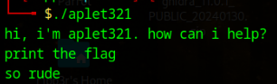
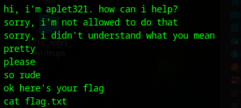
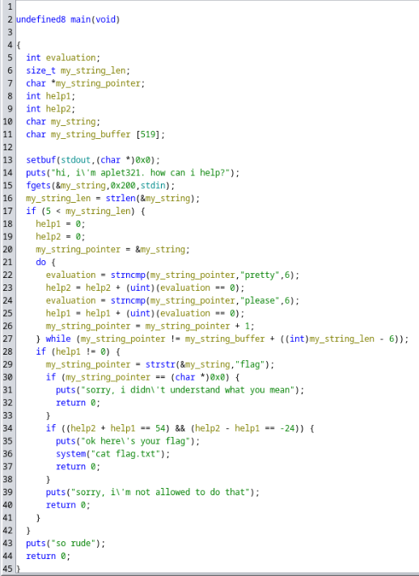
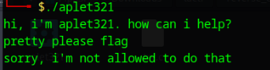
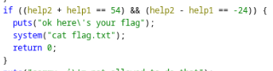
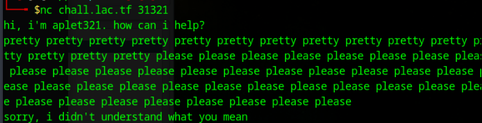
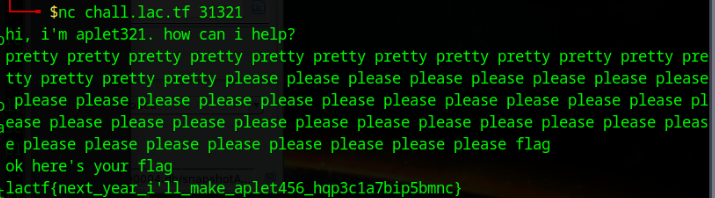

# APLET321 WRITEUP

Unlike Aplet123, Aplet321 might give you the flag if you beg him enough.

The application is reachable by typing this command within the console: nc chall.lac.tf 31321

The first step I've done is to try the program to see how it works. It asks for something to do but when I ask to print the flag it sends back "So rude".

At this point I've tried to print all the human readable strings, the flag is not readable by doing so but I understood that the flag is readden from a file named flag.txt through the cat command. At this point I need to decompile the executable I've got downloaded.

After the program has been analyzed by Ghidra I renamed some variables to better understand what this program does. Basically the program asks for an input that must be composed by a specific number of the strings "pretty" and "please" and the string "flag" (help1 and help2 are used to count the how many times "pretty" and "please" are found within the input string). Since in the previous image I've not write any required string I received the output "So rude". Let's try to insert this three strings and see what happens.

Now the program tells it's not allowed to print the flag. I tried to understand better the program and I see an if's condition in which the variables help1 and help2 are used.

We now know that help1 + help2 must be equal to 54 and help2 - help1 must be equal to -24. This can be solved with a system of two equations and two variables. Solving it I found that help1 must be equal to 15 and help2 to 39. Hence the program expects as input 15 times "pretty" and 39 times "please". Let's try it|

I'm not able to retrive the flag because I forgot the "flag" word that is required since with the "strstr" string the program is trying to find it. Let's now try with the correct payload.

Final payload: pretty pretty pretty pretty pretty pretty pretty pretty pretty pretty pretty pretty pretty pretty pretty please please please please please please please please please please please please please please please please please please please please please please please please please please please please please please please please please please please please please please please flag

Flag is: lactf{next_year_i'll_make_aplet456_hqp3c1a7bip5bmnc}