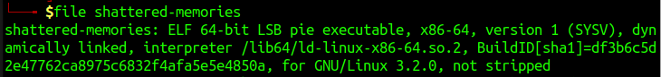
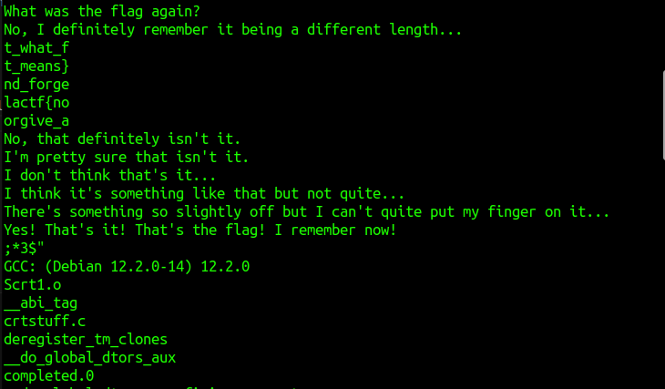

# SHATTERED-MEMORIES WRITEUP

I swear I knew what the flag was but I can't seem to remember it anymore... can you dig it out from my inner psyche?

For this challenge organizers provide us the executable file. Before executing it I collect some very simple information such as the format of the file

and all the human readable strings

Here I noticed something particular, there is the string "lactf{" and another string finishing with "}". I thought the flag is devided into multiple substrings

Hence I try to reconstruct it and at the end I have obtained the correct flag that is: lactf{not_what_forgive_and_forget_means}