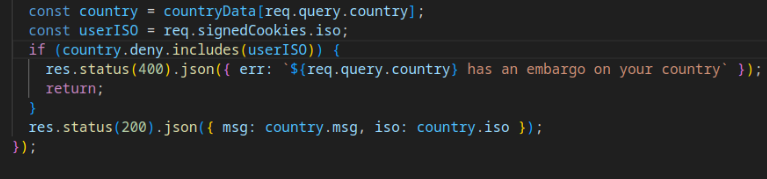

# FLAGLANG WRITEUP

Do you speak the language of the flags?

The web application can be reached at this link: https://flaglang.chall.lac.tf/.

I start by simply analyzing what the web application allow me to do, I can set 
a first languege and it will translate the string "Hello world!" in the second selected language. 

There is also a country called "Flagistan" that if selected allows me to retrive the flag. But seems like there are some contries not allowed to see it.

Then I inspect the source code to try to find something usefull. I focused my attention on the file app.js in which I see the following lines of code that bring me to not having access to the flag.

Hence, a few lines under something took my attention. Basically we have a list of not allowed countries (we can see them in the file countries.yaml) and the string 'US'. Checking the file countries.yaml I understood United States is allowed to see the flag.

The solution is then simple as first country I select US and as second country I select "Flagistan", this allows me to retrive the flag.

The flag is: lactf{n0rw3g7an_y4m7_f4ns_7n_sh4mbl3s}