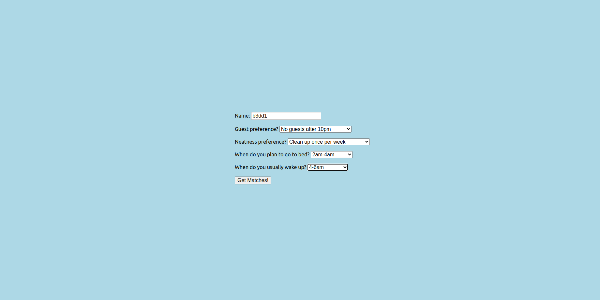
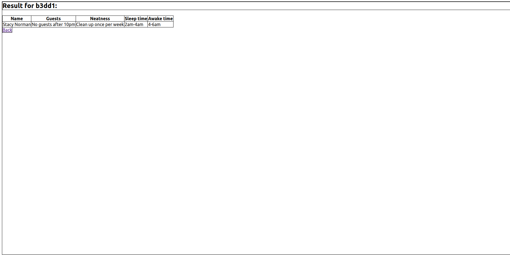
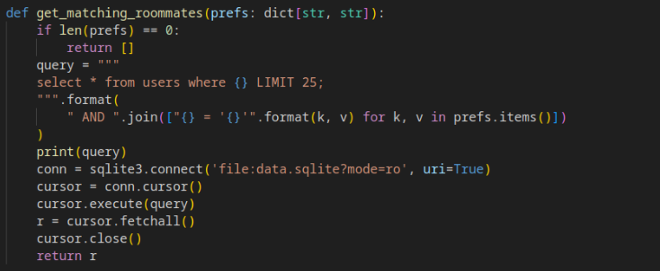
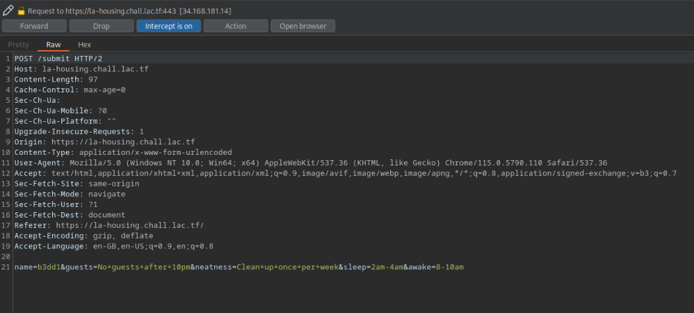
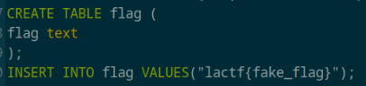
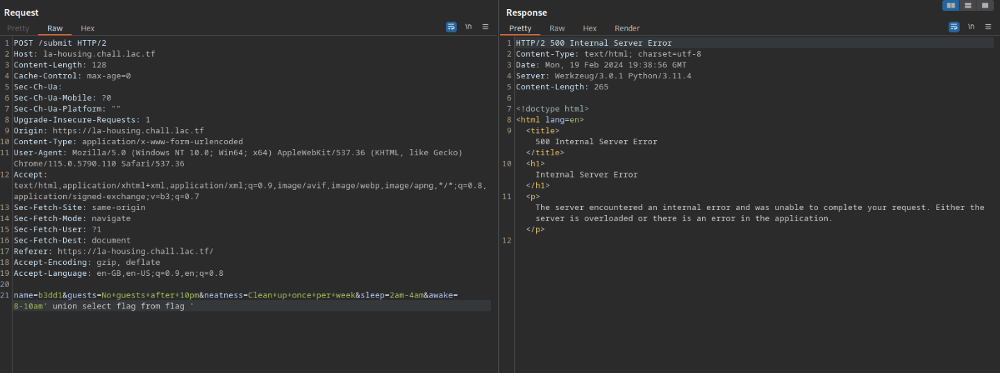
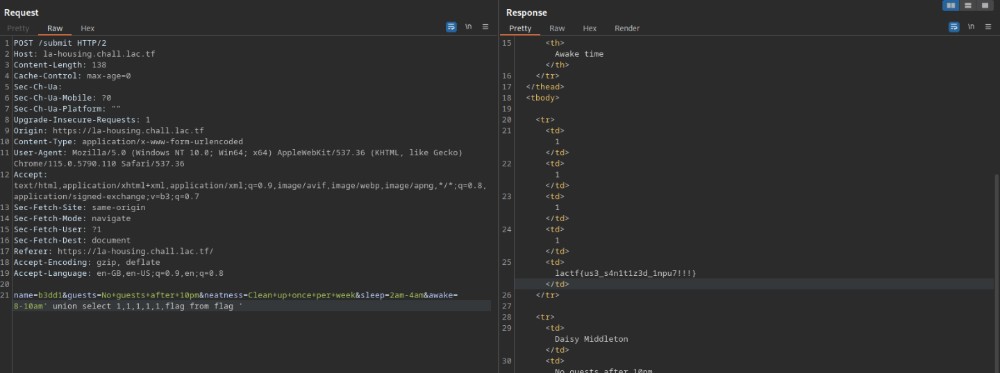

# LA HOUSING PORTAL WRITEUP

Portal Tips Double Dashes ("--") Please do not use double dashes in any text boxes you complete or emails you send through the portal. The portal will generate an error when it encounters an attempt to insert double dashes into the database that stores information from the portal.
Also, apologies for the very basic styling. Our unpaid LA Housing(tm) RA who we voluntold to do the website that we gave FREE HOUSING for decided to quit - we've charged them a fee for leaving, but we are stuck with this website. Sorry about that.

Please note, we do not condone any actual attacking of websites without permission, even if they explicitly state on their website that their systems are vulnerable.

The site is reachable through the following link: https://la-housing.chall.lac.tf.

This web application is pretty simple, we give as input a name and some preferences and it returns as output all the people that fits our preferences.

Also in this case organizers give us the source code of the web application so let's take a look of it. I focus my attention into the file app.py in which I immediatly see which query the app executes when searching over the database for matching people. Basically we are composing the query passing the name of the parameter and the corresponding value received by the form.

Hence I start inspecting a request with BurpSuite and I see better how parameters are sent to the web app. We have a concatenation of name and the parameters we can send.

At this point I thought about a SQL injection but I didn't see were the flag is then I also inspect the file data.sql in which I find out that there is a table called "flag" populated with the flag.

Then using BurpSuite I have tried multiple payloads until I found the correct one that returns us the flag. This is my very first attempt, the payload used generates an internal server error this because I remember that with the union I need the second query selects the exact number of column as the first one.

At the end, after few tries I have found the correct payload that let the web app to send back the flag: ' union select 1,1,1,1,1,flag from flag ' since in the table users the select * statement selects 6 columns.

The final flag is: lactf{us3_s4n1t1z3d_1npu7!!!}
