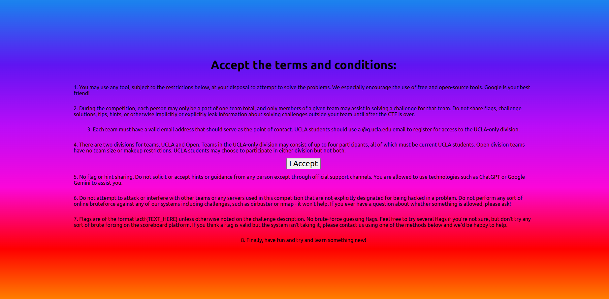
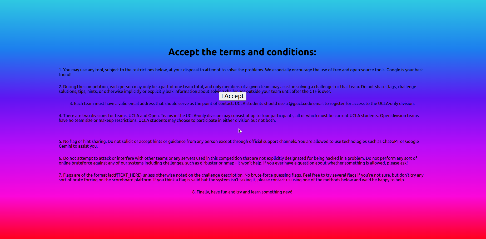
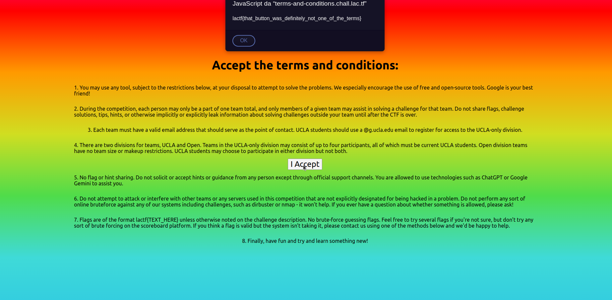

# TERMS-AND-CONDITIONS

Welcome to LA CTF 2024! All you have to do is accept the terms and conditions and you get a flag!

The web application can be reached with the following link: https://terms-and-conditions.chall.lac.tf/.

As you can see in the following image the web application is very simple, there is just a button that, once clicked,
will show the flag.

The problem is once I try to click the button, what happens is the button cannot be clicked since it moves away when
the mouse's cursor is near it.

The solution I found comes by the fact that the console is not allowed to be used. I simply place the cursor in 
the position of the button and I pressed ctrl-r. By doing so the browser will reload the page bringing the 
button in it's original position and after I will be able to click it.

The final flag is: lactf{that_button_was_definitely_not_one_of_the_terms}